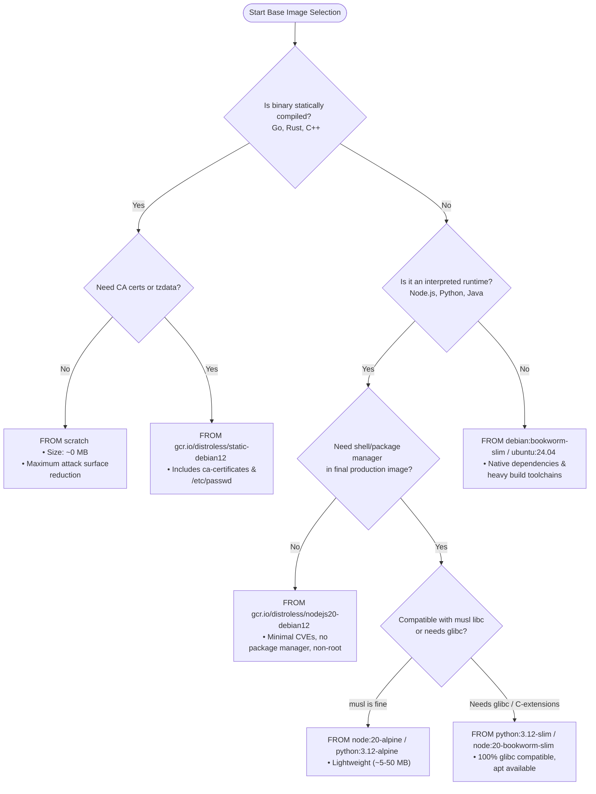
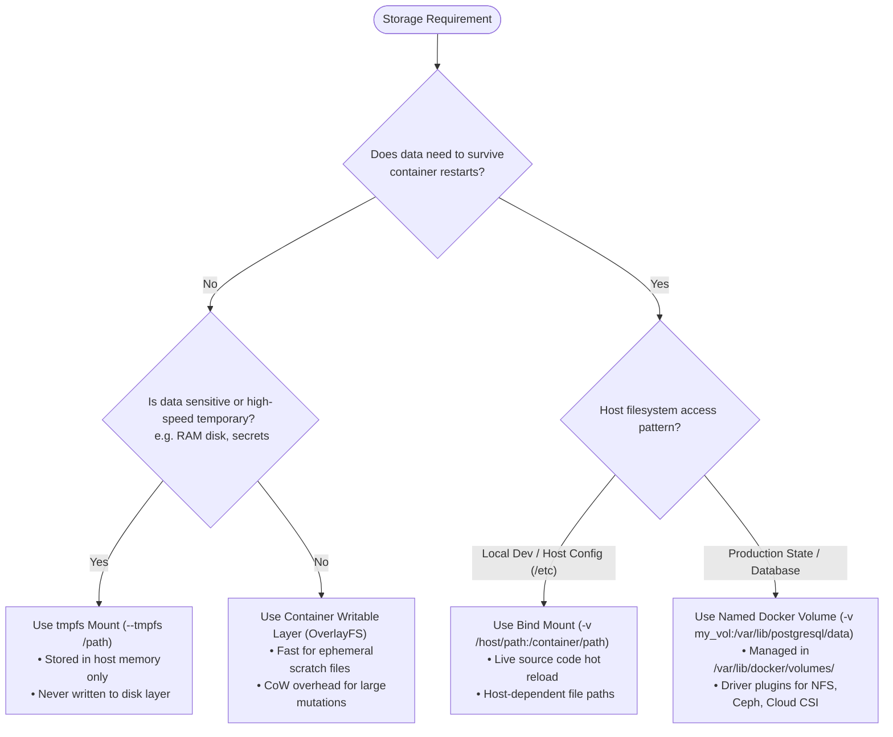
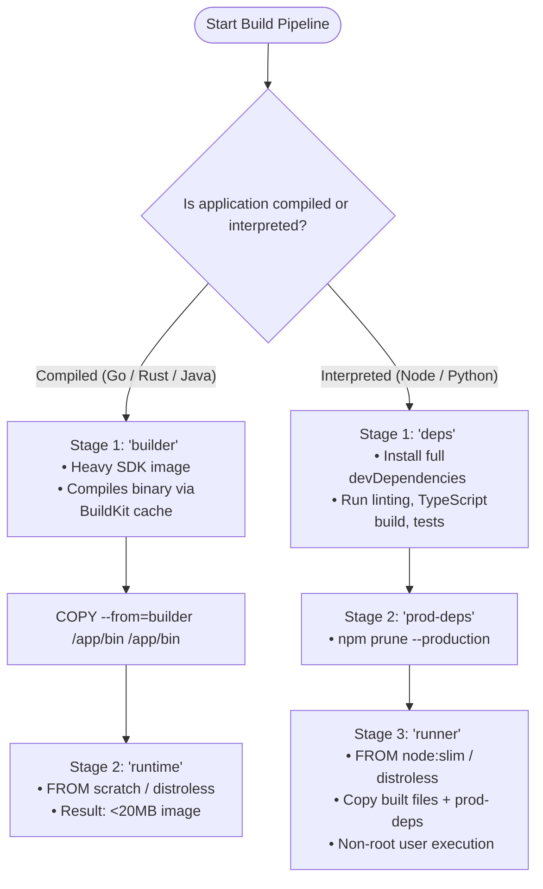

# Docker: Decision Trees (ASCII & Visual)

This document provides structured decision logic trees and visual workflows for choosing **Base Images**, **Storage Mount Strategies**, **Network Drivers**, **Build Optimizations**, and **Container Security Modes**.

---

## 1. Base Image Selection (ASCII Decision Tree)

```
================================================================================
                    DOCKER BASE IMAGE SELECTION DECISION TREE
================================================================================

              What language/runtime is your application and what are its dependencies?
                                       │
        ┌──────────────────────────────┼──────────────────────────────┐
        ▼                              ▼                              ▼
  [ Statically Compiled ]       [ Interpreted / JIT ]          [ Complex Native Deps ]
  Go, Rust, C++ (Static)        Node.js, Python, Java, Ruby    C-extensions, GDAL, CUDA,
        │                              │                       glibc-dependent binaries
        │                              │                              │
        ▼                              ▼                              ▼
  Is a shell or certs needed?    Need debugging tools in prod?  Do you require alpine/musl?
        │                              │                              │
   ┌────┴────┐                    ┌────┴────┐                    ┌────┴────┐
   ▼         ▼                    ▼         ▼                    ▼         ▼
 [ No ]    [ Yes ]              [ No ]    [ Yes ]              [ No ]    [ Yes ]
   │         │                    │         │                    │         │
   ▼         ▼                    ▼         ▼                    ▼         ▼
 USE       USE                  USE       USE                  USE       USE
 SCRATCH   DISTROLESS-STATIC    DISTRO-   SLIM LINUX           DEBIAN-   ALPINE WITH
 - 0 MB    - ~2 MB              LESS      - e.g. python:slim   SLIM or   BUILD DEPS
 - Max     - CA certificates    - No root - Has /bin/sh        UBUNTU    - Smallest
   security  & timezone files     shell   - Full package mgr     SLIM      footprint
```

### Visual Workflow: Base Image Selection



---

## 2. Storage Mount Strategy Selection (ASCII Decision Tree)

```
================================================================================
                 DOCKER STORAGE MOUNT STRATEGY DECISION TREE
================================================================================

                  What is the nature and destination of your container data?
                                       │
        ┌──────────────────────────────┼──────────────────────────────┐
        ▼                              ▼                              ▼
  [ Database / State ]          [ Source Code Sync ]           [ Transient / In-Memory ]
  PostgreSQL, MySQL, Redis,     Local dev hot-reload,          API Session tokens,
  Kafka, Persistent Logs        Host config injection          Secrets, /dev/shm, Build cache
        │                              │                              │
        ▼                              ▼                              ▼
  USE NAMED VOLUMES             USE BIND MOUNTS                USE TMPFS MOUNTS
  - Managed by Docker Engine    - Maps host path directly      - Written strictly to Host RAM
  - Stored in /var/lib/docker   - Fast developer iteration     - Zero disk I/O latency
  - High I/O performance        - File permission coupling     - Auto-cleared on container stop
  - Independent of container    - Environment-specific paths   - No risk of sensitive data
    lifecycle                                                    persisting on disk
```

### Visual Workflow: Storage Mount Architecture



---

## 3. Container Network Driver Selection (ASCII Decision Tree)

```
================================================================================
                 DOCKER NETWORK DRIVER SELECTION DECISION TREE
================================================================================

              Where do containers need to communicate and what are the performance specs?
                                       │
        ┌──────────────────────────────┼──────────────────────────────┐
        ▼                              ▼                              ▼
  [ Single Host Microservices ] [ Multi-Host Cluster Mesh ]    [ Direct L2/L3 Physical Net ]
  Standard Web App + DB on      Swarm cluster or multi-node    Legacy workloads requiring
  one machine                   service mesh                   physical IP from LAN subnet
        │                              │                              │
        ▼                              ▼                              ▼
  USE USER-DEFINED BRIDGE       USE OVERLAY NETWORK            USE MACVLAN / IPVLAN
  - Isolated bridge per app     - Encapsulated VXLAN (UDP 4789)- Direct MAC per container
  - Built-in DNS service name   - Cross-host routing           - Appears as physical device
    resolution (127.0.0.11)     - Encrypted control plane      - Bypasses Linux bridge
        │
        ├───────────────────────┐
        ▼                       ▼
  High-frequency / zero-NAT?    Complete isolation / Air-gapped?
        │                               │
        ▼                               ▼
  USE HOST NETWORK              USE NONE NETWORK
  - Bypasses NAT stack          - Only loopback (127.0.0.1)
  - Direct host port binding    - Air-gapped security
```

---

## 4. Multi-Stage Build & Optimization Strategy (ASCII Decision Tree)

```
================================================================================
               DOCKER MULTI-STAGE BUILD OPTIMIZATION DECISION TREE
================================================================================

                  What assets are needed in your runtime container?
                                       │
        ┌──────────────────────────────┴──────────────────────────────┐
        ▼                                                             ▼
  [ Source code + Compilers ]                                   [ Compiled Artifacts Only ]
  Go build tools, npm node_modules (dev),                       Binary, dist/ bundle, production
  Maven/Gradle, gcc/make, test suites                           node_modules, minimal runtime
        │                                                             │
        ▼                                                             ▼
  STAGE 1: BUILD ENVIRONMENT                                    STAGE 2: RUNTIME ENVIRONMENT
  - Heavy base image (e.g. golang:1.23, node:20)                - Minimal image (distroless / alpine)
  - Use cache mounts:                                           - COPY --from=build-stage
    `--mount=type=cache,target=/root/.cache`                    - Zero compiler tools in prod
  - Build test & compile binaries                               - Radically smaller attack surface
```

### Visual Workflow: BuildKit Multi-Stage Pipeline


