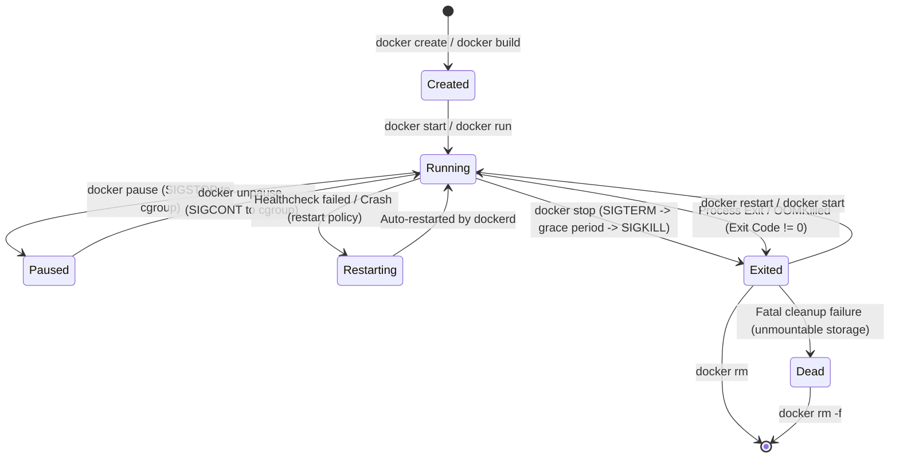

# Docker Architecture & Runtime Mechanics: High-Level & Low-Level Design (HLD / LLD)

A deep-dive technical specification of the **Docker Container Engine**, OCI-compliant container runtime stack, Linux kernel isolation primitives, OverlayFS storage mechanics, container networking topologies, and lifecycle state machines.

---

## 1. High-Level Design (HLD): Client-Server & OCI Runtime Architecture

Docker is built on a modular, decoupled client-server architecture conforming to **Open Container Initiative (OCI)** standards for image specification (`image-spec`) and runtime execution (`runtime-spec`).

### 1.1 Architectural Topology Diagram

```
┌─────────────────────────────────────────────────────────────────────────────┐
│                           CLIENT / USER SPACE                               │
│                                                                             │
│   ┌──────────────────────────┐             ┌────────────────────────────┐   │
│   │        Docker CLI        │             │       Docker Compose       │   │
│   │  (docker run, build, ps) │             │    (docker compose up)     │   │
│   └─────────────┬────────────┘             └─────────────┬──────────────┘   │
└─────────────────┼────────────────────────────────────────┼──────────────────┘
                  │                                        │
                  │  REST API via UNIX Socket / TCP        │
                  │  /var/run/docker.sock or tcp://0.0.0.0 │
                  ▼                                        ▼
┌─────────────────────────────────────────────────────────────────────────────┐
│                       DOCKER DAEMON ENGINE (dockerd)                        │
│                                                                             │
│   ┌─────────────────────────────────────────────────────────────────────┐   │
│   │  • Authentication & Authorization Engine                            │   │
│   │  • Image Management (Pull, Push, BuildKit Graph Builder)             │   │
│   │  • Storage Driver (OverlayFS Layer Manager & CoW Engine)             │   │
│   │  • Network Driver (libnetwork: bridge, host, macvlan, overlay)       │   │
│   │  • Volume Driver (Local Named Volumes, Cloud CSI Storage Plugins)   │   │
│   └──────────────────────────────────┬──────────────────────────────────┘   │
└──────────────────────────────────────┼──────────────────────────────────────┘
                                       │  gRPC API (/run/containerd/containerd.sock)
                                       ▼
┌─────────────────────────────────────────────────────────────────────────────┐
│                          CONTAINER RUNTIME STACK                            │
│                                                                             │
│   ┌─────────────────────────────────────────────────────────────────────┐   │
│   │                      containerd (High-Level)                        │   │
│   │  • Image Distribution & Content Store (/var/lib/containerd/io.c...) │   │
│   │  • Task Execution Supervisor & Event Streaming (FIFO pipes)         │   │
│   │  • Snapshotter Plugins (OverlayFS, Btrfs, Native)                   │   │
│   └───────────────────────┬───────────────────────┬─────────────────────┘   │
│                           │                       │                         │
│                           ▼                       ▼                         │
│                 ┌──────────────────┐    ┌──────────────────┐                │
│                 │ containerd-shim  │    │ containerd-shim  │                │
│                 │   (Container A)  │    │   (Container B)  │                │
│                 └─────────┬────────┘    └─────────┬────────┘                │
│                           │                       │                         │
│                           ▼                       ▼                         │
│                 ┌──────────────────┐    ┌──────────────────┐                │
│                 │  runc (Low-Level)│    │  runc (Low-Level)│                │
│                 │ (OCI Runtime CLI)│    │ (OCI Runtime CLI)│                │
│                 └─────────┬────────┘    └─────────┬────────┘                │
└───────────────────────────┼───────────────────────┼─────────────────────────┘
                            │                       │
                            ▼                       ▼
┌─────────────────────────────────────────────────────────────────────────────┐
│                           LINUX KERNEL SUBSYSTEM                            │
│                                                                             │
│   ┌─────────────────────────────────┐   ┌───────────────────────────────┐   │
│   │        Linux Namespaces         │   │       cgroups v2 Control      │   │
│   │  • PID (Process Tree Isolation) │   │  • cpu.max (Throttling)       │   │
│   │  • NET (Virtual Interface/veth) │   │  • memory.max (Hard Limit)    │   │
│   │  • MNT (Mount Table Isolation)  │   │  • memory.high (Soft Limit)   │   │
│   │  • IPC (POSIX Queues & Shared)  │   │  • io.weight (Disk I/O QoS)   │   │
│   │  • UTS (Hostname / Domain)      │   │  • pids.max (Fork Bomb Guard) │   │
│   │  • USER (UID/GID Mapping)       │   │                               │   │
│   └─────────────────────────────────┘   └───────────────────────────────┘   │
│   ┌─────────────────────────────────┐   ┌───────────────────────────────┐   │
│   │     OverlayFS (Storage CoW)     │   │      Security Filters         │   │
│   │  lowerdir, upperdir, merged     │   │  Seccomp, AppArmor, Cap Drop  │   │
│   └─────────────────────────────────┘   └───────────────────────────────┘   │
└─────────────────────────────────────────────────────────────────────────────┘
```

---

## 2. Low-Level Design (LLD): Linux Kernel Container Mechanics

### 2.1 Linux Kernel Isolation Primitives

Containers are not virtual machines; they are standard Linux host processes bounded by **7 Linux Namespaces**, throttled by **cgroups v2**, and restricted by **Capabilities & Seccomp profiles**.

| Kernel Primitive | Subsystem / System Call | Architectural Functionality in Docker |
| :--- | :--- | :--- |
| **`PID` Namespace** | `clone(CLONE_NEWPID)` | Isolates the process ID tree. The container entrypoint becomes `PID 1` inside its namespace, preventing visibility of host processes. |
| **`NET` Namespace** | `clone(CLONE_NEWNET)` | Isolates network stacks: routing tables, firewall rules, IP addresses, and loopback. Connected to host via `veth` pair. |
| **`MNT` Namespace** | `clone(CLONE_NEWNS)` | Isolates filesystem mount points. The container sees only its root filesystem (`/`) constructed via `pivot_root`. |
| **`IPC` Namespace** | `clone(CLONE_NEWIPC)` | Isolates Inter-Process Communication, POSIX message queues, and SysV shared memory segments (`/dev/shm`). |
| **`UTS` Namespace** | `clone(CLONE_NEWUTS)` | Isolates hostname and NIS domain name, allowing independent container hostnames (`--hostname`). |
| **`USER` Namespace** | `clone(CLONE_NEWUSER)` | Maps root (`UID 0`) inside the container to an unprivileged user (e.g., `UID 100000`) on the host to prevent privilege escalation. |
| **`CGROUP` Namespace** | `clone(CLONE_NEWCGROUP)`| Isolates the `/proc/self/cgroup` view so the container cannot observe the root cgroup hierarchy. |

---

### 2.2 cgroups v2 Unified Hierarchy & Resource Limits

Under **cgroups v2** (unified hierarchy at `/sys/fs/cgroup`), Docker regulates container consumption without kernel deadlocks or multi-hierarchy synchronization issues.

```
/sys/fs/cgroup/
├── cgroup.controllers (cpu, memory, io, pids, cpuset)
└── system.slice/
    └── docker-<container_id>.scope/
        ├── cpu.max        # "quota period" -> e.g., "150000 100000" (1.5 CPUs)
        ├── memory.max     # Hard memory ceiling (Bytes) -> triggers OOM Killer if exceeded
        ├── memory.high    # Soft memory ceiling -> triggers proactive page cache reclaim
        ├── memory.current # Live resident memory usage
        ├── io.weight      # Relative block I/O scheduling weight (1-10000)
        └── pids.max       # Maximum active process/thread count (anti-forkbomb)
```

---

### 2.3 Storage Architecture: OverlayFS 3-Tier Layer Mechanics & Copy-on-Write (CoW)

Docker uses the **OverlayFS** union filesystem driver to merge multiple immutable image layers with a single mutable container layer.

```
┌─────────────────────────────────────────────────────────────────────────────┐
│               OVERLAYFS UNIFIED MOUNT STRUCTURE (/merged)                   │
│                                                                             │
│   Unified View: /app/server.js (rw), /bin/sh (ro), /etc/hosts (virtual)     │
└──────────────────────────────────────┬──────────────────────────────────────┘
                                       │
                    ┌──────────────────┴──────────────────┐
                    │                                     │
                    ▼                                     ▼
┌──────────────────────────────────────┐┌─────────────────────────────────────┐
│    CONTAINER READ-WRITE LAYER        ││        OVERLAYFS WORK DIRECTORY     │
│             (/upperdir)              ││              (/workdir)             │
│                                      ││                                     │
│ • Newly created files                ││ • Internal kernel staging area      │
│ • Mutated files (Copied-on-Write)    ││ • Atomic directory rename & whiteout│
│ • Whiteout markers (`.wh.<filename>`)││   preparation space                 │
└──────────────────┬───────────────────┘└─────────────────────────────────────┘
                   │
                   ▼
┌─────────────────────────────────────────────────────────────────────────────┐
│                 IMMUTABLE READ-ONLY IMAGE LAYERS (/lowerdir)                │
│                                                                             │
│   ┌─────────────────────────────────────────────────────────────────────┐   │
│   │ Layer 3: Application Code & Assets (e.g., /app/src)                 │   │
│   ├─────────────────────────────────────────────────────────────────────┤   │
│   │ Layer 2: Runtime Dependencies (e.g., Node.js / Python / JDK)        │   │
│   ├─────────────────────────────────────────────────────────────────────┤   │
│   │ Layer 1: Base OS Rootfs (e.g., Alpine Linux / Ubuntu / Debian-slim) │   │
│   └─────────────────────────────────────────────────────────────────────┘   │
└─────────────────────────────────────────────────────────────────────────────┘
```

#### Copy-on-Write (CoW) Execution Mechanics:
1. **File Read**: If a file exists in the container layer (`upperdir`), it is read directly. If not, the kernel searches sequentially down through `lowerdir` layers from top to bottom.
2. **File Modification**: If a container modifies an existing image file:
   - The kernel performs a **Copy-Up** operation, duplicating the entire file from `lowerdir` into `upperdir`.
   - The modification is applied in `upperdir`. The original file in `lowerdir` remains bit-for-bit immutable.
3. **File Deletion**: When a file from `lowerdir` is deleted inside the container:
   - A special **whiteout character device file** (`.wh.<filename>`) is created in `upperdir`.
   - The OverlayFS driver masks the file from the unified `/merged` view.

---

## 3. Container Lifecycle State Machine

The Docker container execution cycle operates under a deterministic state machine governed by POSIX signals, cgroup events, and process exit codes.



### Standard Container Exit Codes Reference

| Exit Code | Termination Signal / Cause | Technical Explanation & Root Cause |
| :--- | :--- | :--- |
| **`0`** | Clean Termination | Container main process completed successfully and cleanly returned `0`. |
| **`1`** | General Application Error | Application threw an uncaught exception, syntax error, or explicitly called `exit(1)`. |
| **`125`** | Docker Daemon Error | `docker run` failed on the host itself (e.g., invalid flags, cgroup configuration issue). |
| **`126`** | Permission Denied | Container command cannot be executed (e.g., missing `chmod +x` on entrypoint script). |
| **`127`** | Command Not Found | Container binary/executable specified in `CMD` or `ENTRYPOINT` does not exist in `$PATH`. |
| **`137`** | `SIGKILL` (128 + 9) / **OOM** | Killed by Linux Out-Of-Memory Killer (`OOMKilled: true`) or forced `docker kill`. |
| **`139`** | `SIGSEGV` (128 + 11) | Segmentation fault: Application attempted to access unallocated/protected host memory. |
| **`143`** | `SIGTERM` (128 + 15) | Graceful stop initiated via `docker stop`. Application received standard termination signal. |

---

## 4. Container Networking Datapath & Topologies

Docker uses the `libnetwork` subsystem implementing the **Container Network Model (CNM)**.

```
                               HOST INTERFACE (eth0: 192.168.1.50)
                                              │
                    ┌─────────────────────────┴─────────────────────────┐
                    │  IPTABLES NAT / MASQUERADE / PORT FORWARDING      │
                    │  -A PREROUTING -p tcp --dport 8080 -j DNAT ...    │
                    └─────────────────────────┬─────────────────────────┘
                                              │
                                   DOCKER BRIDGE (docker0)
                                     IP: 172.17.0.1/16
                                              │
                      ┌───────────────────────┴───────────────────────┐
                      │                                               │
             veth_host_a (Peer A)                            veth_host_b (Peer B)
                      │                                               │
               [ Linux Kernel ]                                [ Linux Kernel ]
                      │                                               │
             veth_cont_a (eth0)                              veth_cont_b (eth0)
             IP: 172.17.0.2/16                               IP: 172.17.0.3/16
       ┌──────────────────────────────┐                ┌──────────────────────────────┐
       │   CONTAINER A (NET NS)       │                │   CONTAINER B (NET NS)       │
       │   Port 80/TCP Exposed        │                │   Embedded DNS: 127.0.0.11   │
       └──────────────────────────────┘                └──────────────────────────────┘
```

### Network Driver Comparison

| Driver | Scope | Packet Routing Datapath | Primary Enterprise Use Case |
| :--- | :--- | :--- | :--- |
| **`bridge`** | Single-Host | Creates a virtual switch (`docker0` or user-defined). Containers obtain private IPs; external traffic is routed via iptables NAT. User-defined bridges include automatic embedded DNS resolution (`127.0.0.11`). | Standard microservice workloads running on a standalone Docker host. |
| **`host`** | Single-Host | Bypasses network namespace isolation completely. Container attaches directly to the host's network interfaces. Zero NAT routing overhead. | Maximum throughput, ultra-low latency requirements (e.g., high-frequency trading, WebRTC). |
| **`macvlan`** | Single-Host / L2 | Assigns a physical MAC address to each container. Containers appear as distinct physical devices directly attached to the physical subnet. | Legacy applications expecting direct Layer 2 subnet presence without NAT. |
| **`overlay`** | Multi-Host | Encapsulates Layer 2 container traffic inside UDP packets (VXLAN port 4789) routed across multiple Docker/Swarm hosts. | Multi-host container communication and Docker Swarm cluster meshes. |
| **`none`** | Single-Host | Disables all networking except the local loopback interface (`127.0.0.1`). | Isolated batch processing, air-gapped cryptographic signing, sandbox jobs. |

---

## 5. Next-Gen BuildKit DAG Engine Architecture

**BuildKit** replaces the legacy linear Docker builder with a **Directed Acyclic Graph (DAG)** execution planner.

```
                              ┌────────────────────────┐
                              │  Dockerfile AST Parser │
                              └───────────┬────────────┘
                                          │
                                          ▼
                              ┌────────────────────────┐
                              │ Low-Level Build Graph  │
                              │      (LLB Engine)      │
                              └───────────┬────────────┘
                                          │
                        ┌─────────────────┴─────────────────┐
                        │                                   │
                        ▼                                   ▼
             ┌─────────────────────┐             ┌─────────────────────┐
             │ Stage 1: Backend    │             │ Stage 2: Frontend   │
             │ Go/Rust Build (LLB) │             │ Node/Vite Build(LLB)│
             │ [Runs in Parallel]  │             │ [Runs in Parallel]  │
             └──────────┬──────────┘             └──────────┬──────────┘
                        │                                   │
                        └─────────────────┬─────────────────┘
                                          │
                                          ▼
                              ┌────────────────────────┐
                              │ Stage 3: Final Runtime │
                              │ (Distroless / Scratch) │
                              │   Artifact Copy Only   │
                              └───────────┬────────────┘
                                          │
                                          ▼
                              ┌────────────────────────┐
                              │ OCI Image Distribution │
                              │ (Export Tar / Registry)│
                              └────────────────────────┘
```

### BuildKit Performance Optimizations:
1. **Parallel Stage Execution**: Independent build stages execute concurrently across all available CPU cores.
2. **Cache Mounts (`--mount=type=cache`)**: Persists package manager caches (`npm`, `pip`, `go build`, `cargo`, `apt`) across builds without writing them into final image layers.
3. **Secret Mounts (`--mount=type=secret`)**: Exposes sensitive build credentials (SSH keys, tokens) to build commands in-memory without burning them into the layer cache or image history.
4. **Skip Unused Stages**: Target-based execution (`--target`) prunes unnecessary build branches entirely from the compilation graph.
