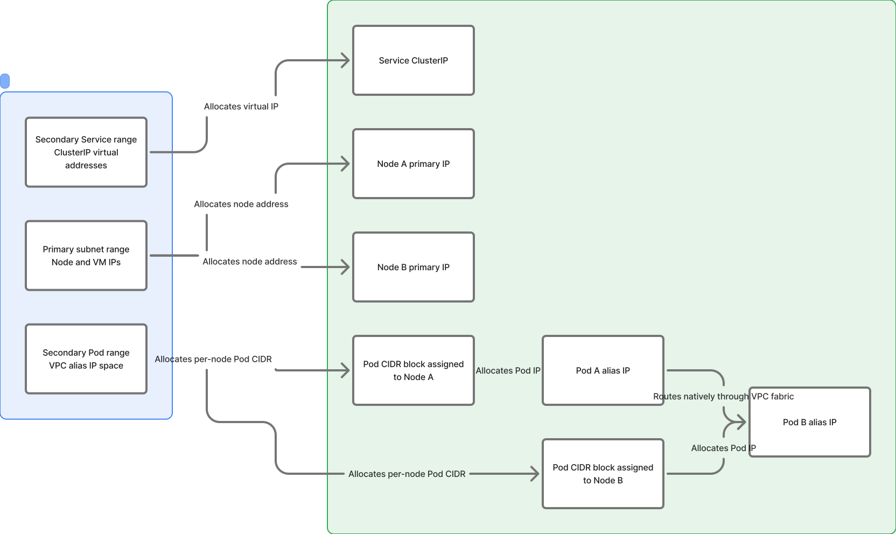
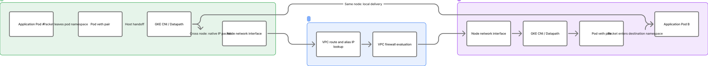
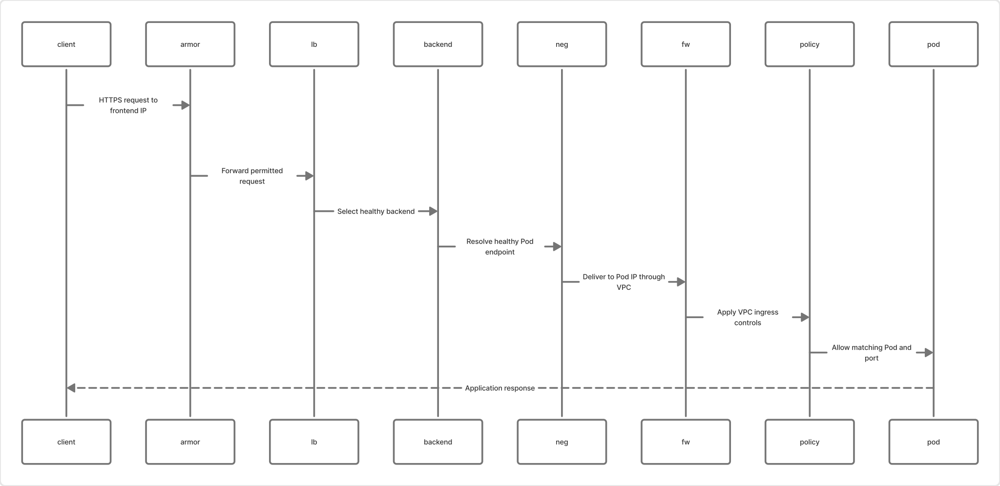
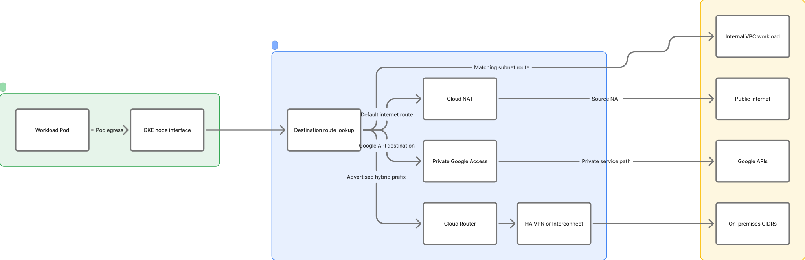
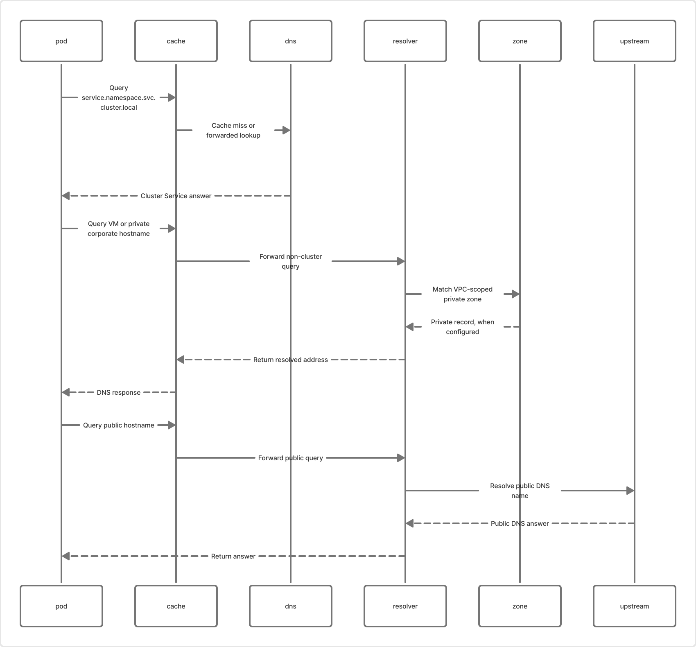
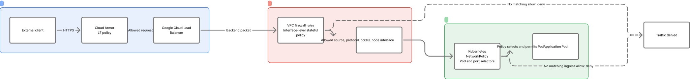
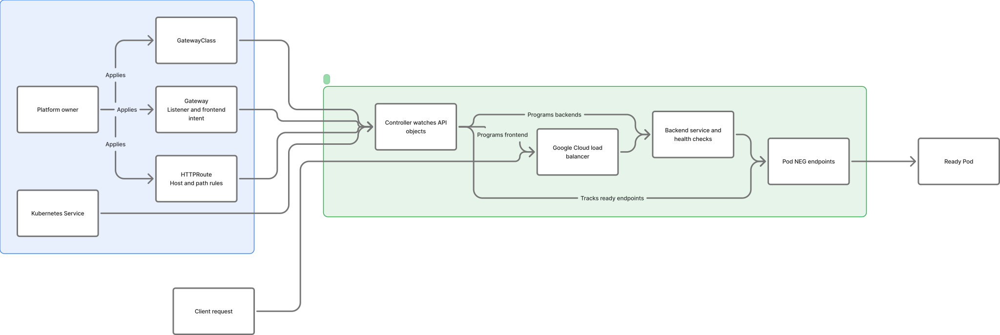
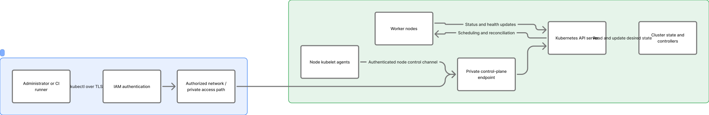
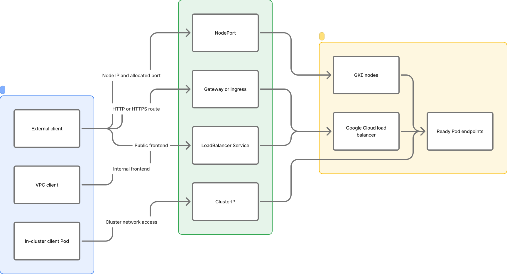
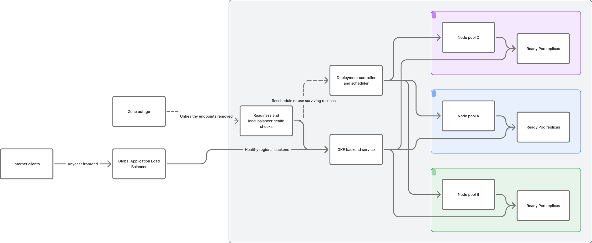

# GKE Networking Architecture (Figma)

[Open the editable GKE Networking — In Depth FigJam board](https://www.figma.com/board/iaDzdSJX1eyF3lQHWup2tC/)

The board illustrates a color-coded GKE networking reference, including:

- Public ingress through Cloud Armor and the global external Application Load Balancer to GKE NEG pod endpoints.
- Regional subnet primary range for node addresses, and secondary ranges for VPC-native Pod alias IPs and Service ClusterIP addresses.
- GKE nodes, pods, Service endpoint selection, and same-cluster pod traffic.
- Authorized access to the private GKE control-plane endpoint from administrators and node kubelets.
- VPC firewall policy and routing, outbound internet access through Cloud NAT, and Google API access through Private Google Access.

## Detailed diagrams on the board

These are Figma-rendered vector previews stored in this repository, so they display directly on GitHub. Open the board above to edit them in FigJam.

### 1. VPC-native IP allocation

### 2. Pod-to-Pod datapath

### 3. External ingress to a Pod

### 4. Egress routing choices

### 5. Cluster DNS resolution

### 6. Layered network security

### 7. Gateway API reconciliation

### 8. Private control-plane connectivity

### 9. Kubernetes Service exposure paths

### 10. Multi-zone availability and failover

## Related repository references

- [Unified Kubernetes, CNI, and GCP VPC networking guide](./networking-shell-command.md)
- [Kubernetes high- and low-level design](./hld-lld-design.md)
- [Kubernetes command reference](./shell-commands.md)
- [Kubernetes official references](./references.md)

This is a reference architecture. CIDR ranges and optional components should be checked against the target cluster configuration before implementation.
