# GCP VPC and Compute Networking Architecture (Figma)

[Open the editable GCP VPC and Compute Networking — In Depth FigJam board](https://www.figma.com/board/Kd7WWDvyHMlGiGOshplrse/)

The board uses separate colors for client/external systems, the global load-balancing edge, the VPC boundary, and regional subnets. It covers:

- A global custom-mode VPC with regional subnets in `us-central1` and `europe-west1`.
- Compute Engine instances managed by regional managed instance groups, with global Application Load Balancer backends and cross-region failover.
- Global VPC routes and distributed firewall rules applied to workload interfaces.
- Internet-bound egress through Cloud NAT and private Google API access through Private Google Access.
- Hybrid connectivity using HA VPN and Cloud Router BGP route exchange.

The subnet CIDRs shown (`10.1.0.0/24` and `10.2.0.0/24`) are illustrative examples from the repository's architecture notes, not deployment settings.

## Detailed diagrams on the board

These are Figma-rendered vector previews stored in this repository, so they display directly on GitHub. Open the board above to edit them in FigJam.

### 1. Global VPC and regional subnets

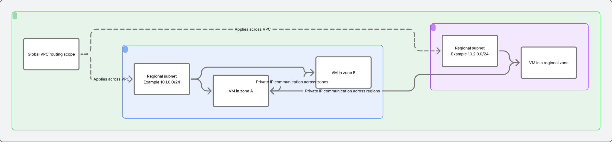

### 2. Subnet addressing and reserved IPs

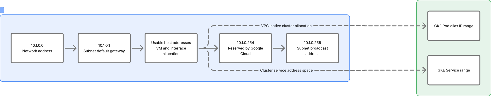

### 3. Compute Engine packet lifecycle

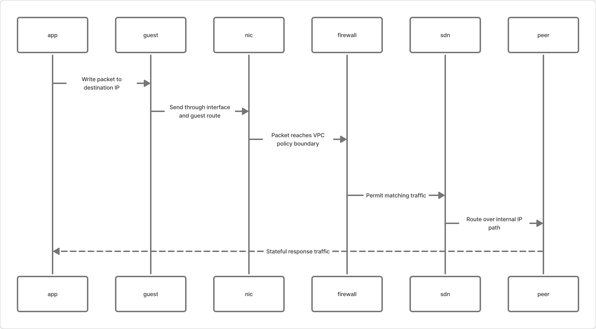

### 4. Route selection and next hops

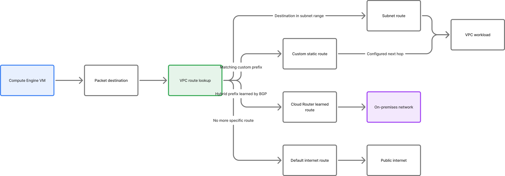

### 5. Stateful firewall evaluation

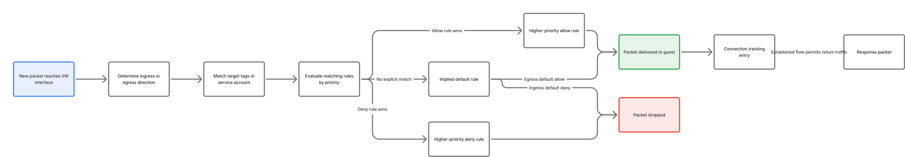

### 6. Egress, Cloud NAT, and Google APIs

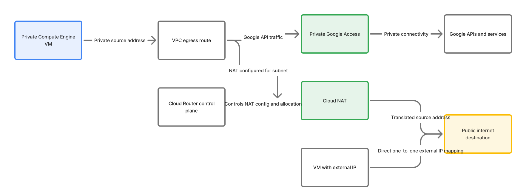

### 7. Global load balancer and regional MIGs

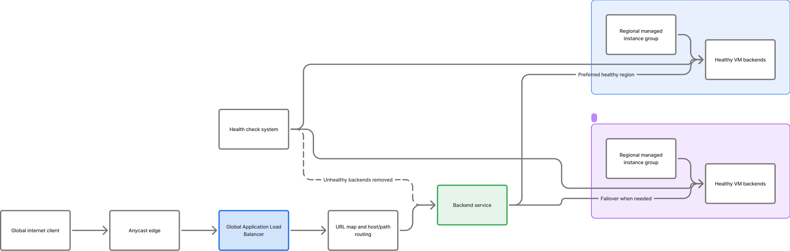

### 8. HA VPN and Cloud Router BGP

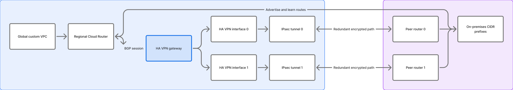

### 9. Shared VPC host and service projects

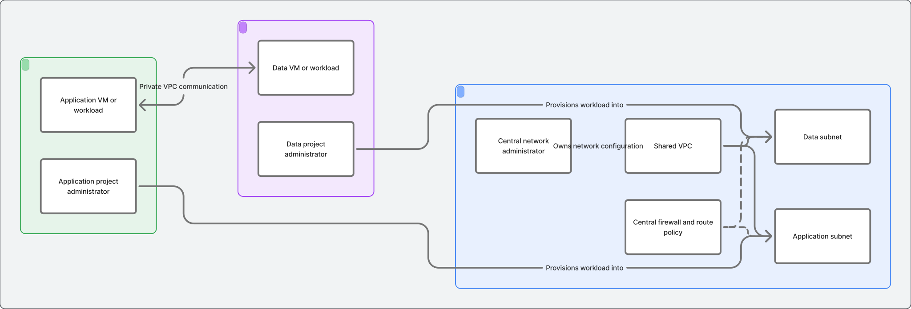

### 10. VPC Network Peering and isolation

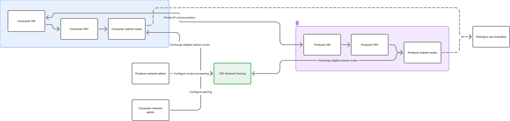

### 11. Subnet and secondary range growth

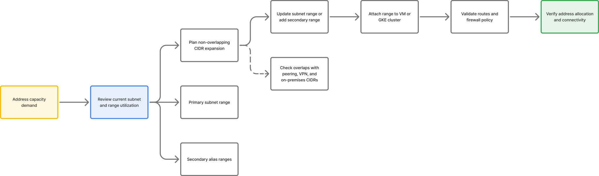

### 12. Network diagnostics and observability

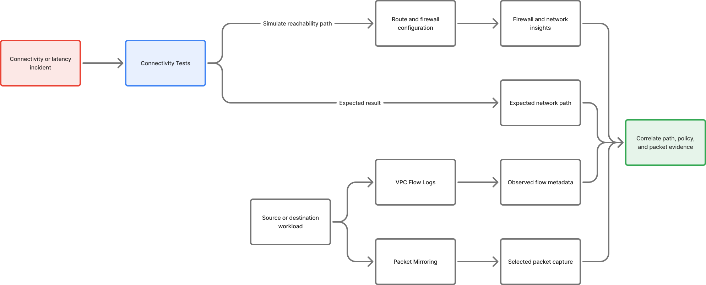

## Related repository references

- [VPC high- and low-level design](./hld-lld-design.md)
- [VPC and subnet command reference](./shell-commands.md)
- [Compute Engine architecture and CLI references](../compute-engine/README.md)
- [VPC case studies: topology, packet lifecycle, Compute integration, and configuration](./casestudy/README.md)
- [VPC official references](./references.md)
